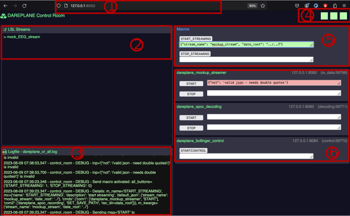

# Control Room


This module is used to combine other Dareplane modules into a full system.

## Configuration

A configuration is created for each system you want to specify. Usually this means that you would have a configuration for each experiment. As long as all modules are available, sharing or recreating your setup with another machine is as simple as copying the config file. A bit like configs in `.bashrc` etc.

Have a look at `./configs/example_cfg.toml` for how a config could look like.

Configs have two important sections, one for the setup of single modules and another one for composing commands to macros.

### Single Modules

Modules are sorted according to the technology they are written in. Currently only python modules get spawned up and are managed from the control_room automatically. Other modules can also be integrated, you just would have to start and step e.g. the `C` application manually. This will change in the future to allow similar treatment of non-python modules.

In a typical config you specify a `type` (just used for labeling in the [GUI](#the-gui)), and a `port` and `ip` which are used to spawn each modules individual server at that location. Additionally you can pass `kwargs` to the servers creation.

```toml
[python]
modules_root = '../'                                                            # path to the root if the modules
# -------------------- Mockup Streamer ---------------------------------------
[python.modules.dp_mockup_streamer]                                      # names of a module to be used (folder name)
    type = 'io_data'
    port = 8082                                                                 # if no port is provided, a random free port is chosen
    ip = '127.0.0.1'
[python.modules.dp_mockup_streamer.kwargs]                               # kwargs to run the main script with
    lsl_out_stream_name = 'mockup_EEG_stream'
    random_data = true
```

_Note_ - there is no need to specify the commands a module is capable of doing. The control_room module will ask each other individual module for its capabilities by sending a `GET_PCOMMS` command to their servers, which on default will return all commands a module is capable of performing.

### Marcros

A macro is a combination of commands and potential parameters which are sent alongside individual commands within the macro.

```toml
[macros]

[macros.start_streaming]
    name = 'START_STREAMING'
    description = 'start streaming'
[macros.start_streaming.default_json]
    stream_name_parameter = 'mockup_EEG_stream'
    date_root = '../$<stream_name_parameter>'
    delay_s = 0.5
[macros.start_streaming.cmds]
    # [<target_module>, <PCOMM>, <kwarg_name1 (optional)>, <kwarg_name2 (optional)>]
    com1 = ['dp_mockup_streamer', 'START', 'stream_name=stream_name_parameter']
    com2 = ['dp_spoc_recording', 'SET_SAVE_PATH', 'rec_dir=data_root']
```

Section `[macros.start_streaming]`

- `name` - the name which will appear as the label of the button to execute the macro.
- `description` - some details only relevant as meta information at the moment.

Section `[macros.start_streaming.default_json]`

- Here you can specify arbitrary kwargs which you can refer to in the `.cmds` section. These will also appear on the [GUI](#the-gui) in the according text boxes right of the macros button. If you change the value in the GUI, the new value will be used within sending the individual commands of the macro.
- `delay_s` - this is a special which you can use to introduce a delay in seconds between executing individual commands within a macro. This might be necessary if an individual module requires a previous module to e.g. have its [LSL](https://labstreaminglayer.org/#/) stream broadcast.
- `date_root = '../$<stream_name_parameter>'` - shows how templating can be used to create dependencies between the created kwargs. With the above example, `data_root` would thus end up as `'../mockup_EEG_stream'`.

Section `[macros.start_streaming.cmds]`

- Here you specify individual steps which each are a list containing:

  - (1) the name of the module to send to as specified in the config. The name here is the `toml` identifier, e.g. `[python.dp-mockup-streamer]` -> `dp-mockup-streamer`.
  - (2) the primary command that is send to the module, e.g. `START`
  - (3-) an arbitrary number of kwargs linked to the kwargs specified in the previous section. E.g. `'stream_name=stream_name_parameter'`

  Using `com1 = ['dp_mockup_streamer', 'START', 'stream_name=stream_name_parameter']` with the config example shown above, would lead to the message of `START|{'stream_name': 'mockup_EEG_stream'}` being sent to the server at e.g. `127.0.0.1:8082`.

## The GUI



1. You find the GUI on your local host at port `8050` after running `python rcr.py` (just a conveniece entry point) or `python -m control_room.main`.
2. An overview of [LSL](https://labstreaminglayer.org/#/) streams currently visible on the network. The overview is refreshed every 3 seconds.
3. The lasts lines of the log file located at `./dareplane_cr_all.log`. This is updated every 3 seconds.
4. Indicators for the status of the servers of individual modules. Once a secondevery server of the spawned modules (here it is 3 of them, (1) dareplane_mockup_streamer, (2) dareplane_spoc_decoding and (3) dareplane_bollinger_control) is pinged with a short query to see if it is running. On hover over the squares you will get additional meta information.
5. Macros as specified in the config - see [macros](#marcros). The text fields are used to specify json payloads to be send along with the commands within a macro. The colored background appears once you start editing and is green if the input is valid json and red otherwise.
6. Individual exposed primary commands to control single modules individually. These are used for debugging and for any other interaction which would just involve a single command.
